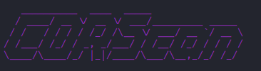
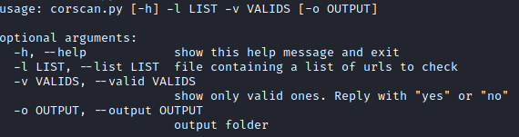

# CORScan
「🔎」CORS vulnerability scanner



# Help


# Images


# Functions

* Automatically fixes missing "http://" in your list
* Choose whether you want only valid or invalid ones to appear
* Create a PoC automatically

# Tested operating systems

* Linux

# Tutorial

```
$ git clone https://github.com/MrEmpy/CORScan.git
$ cd CORScan
$ chmod +x install.sh
$ sudo ./install.sh
```
